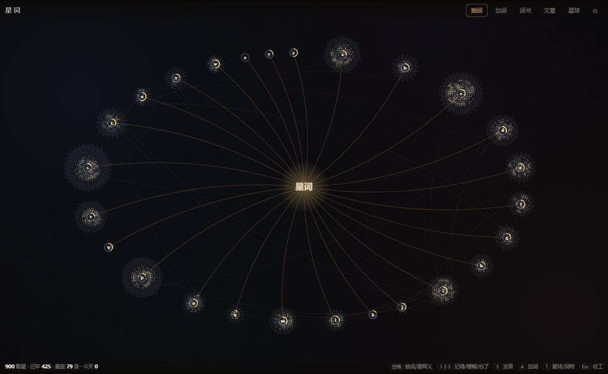
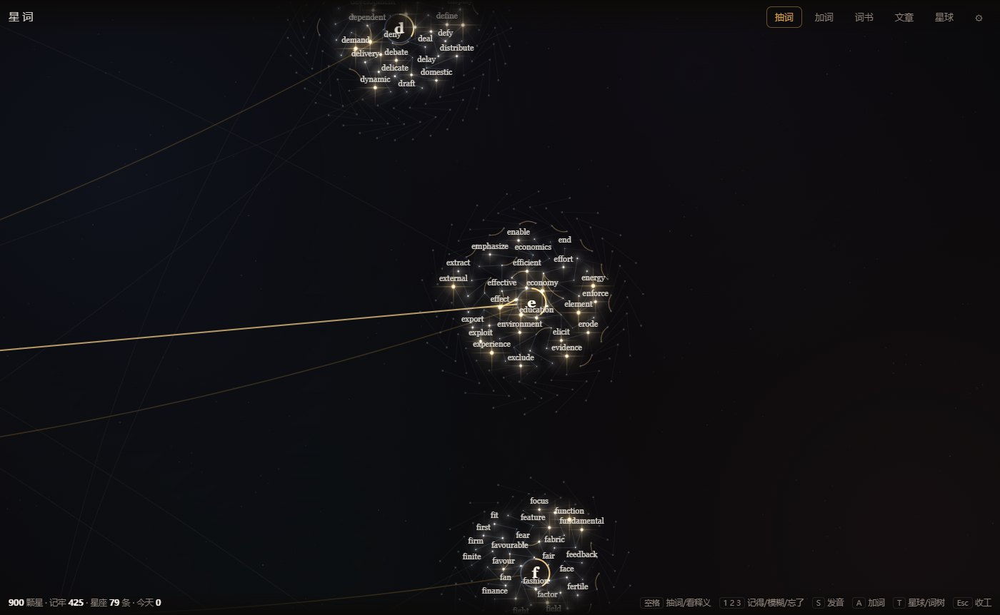
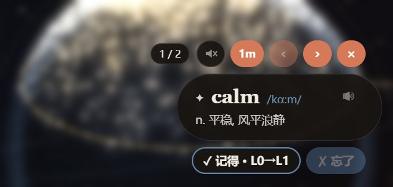

# 星词 · Xingci

一颗由你认识的单词组成的星球。无聊的时候点开抽几个，没有打卡，没有每日任务，没有连续天数。


- **纬度 = 点亮的先后**：每 50 个词一条纬度带，最早的在北，最新的在南，最新那条带发金光。
- **亮度 = 熟练度**，同时也是色温：生疏的偏冷蓝，记牢的偏暖金。
- **同族词连成星座**：鼠标停在一颗星上，它的派生词（economy · economic · economist）会一起亮起来。
- **一轮 10 个，抽完必停**，给「再来一轮 / 收工」。「点开看两个」不应该变成不知不觉刷半小时。
- **词树**：一键把星球摊开成按字母和词族长出来的知识树，再按一下收拢回来。
- **记录**：每一次评分、点亮都记一笔。按天回看、错词本、这一周，哪天的词都能单独再复查一遍，也能导出成 Markdown。
- **喂文章**：把你读过的文章贴进来，以后抽到文里的词，卡片会给出原句，并告诉你是在哪篇读到的。
- **桌面浮窗**（可选）：一个置顶的小胶囊，隔一会儿从星空里弹一个词，全屏看视频、写代码时也在。

## 快速开始

**网页版**：下载后直接双击 `index.html`。不用装任何东西，也没有账号。

**桌面版**（多了托盘和浮窗）：在 Releases 页下载 exe。

- `Xingci-x.y.z-portable.exe`：便携版，双击就用。进度存在 exe 旁边的 `save` 文件夹里，拷走整个文件夹就连进度一起带走
- `Xingci-x.y.z-setup.exe`：安装版，可以选装到哪个盘。进度存在 `%APPDATA%\星词\save`，卸载不会删

exe 没有数字签名，第一次打开 Windows 会提示「Windows 已保护你的电脑」，点「更多信息 → 仍要运行」。

也可以从源码跑，需要 [Node.js](https://nodejs.org/)：

```
cd desktop
npm install
npm start
```

国内网络下载 Electron 慢的话，先设一下镜像再 `npm install`：

```
# PowerShell
$env:ELECTRON_MIRROR = "https://npmmirror.com/mirrors/electron/"
# macOS / Linux
export ELECTRON_MIRROR=https://npmmirror.com/mirrors/electron/
```

第一次打开时选一本词书，填上已经学到第几个，前面的词会直接点亮成星星。之后每轮会从这本书里按顺序带几个新词进来，数量在「词书」里调，可以设成 0。

也可以不按词书来：「加词」里输入一个词就能点亮它（输入 went 会找到 go），或者一次粘贴一整张词表。

| 键 | 作用 |
|---|---|
| `空格` | 抽一轮 / 看释义 / 点亮新词 |
| `1` `2` `3` | 记得 / 模糊 / 忘了 |
| `K` | 新词：早就认识 |
| `S` | 读一遍 |
| `A` | 加词 |
| `T` | 星球 / 词树 |
| `Esc` | 收工 |

手机浏览器也能打开：拖动转球，双指缩放，点一颗星看它。


## 词树

顶栏的「词树」按钮（或按 `T`）会把星球摊开成一棵放射状的树：中间是根，外面一圈是 26 个字母，每个字母底下的词一圈圈往外长。已点亮的在里圈，还没点亮的暗星在外圈；同族词排在一起、互相连线，跨字母的同族词之间有一条淡淡的长弧。字母节点外圈的金色弧表示这个字母点亮了多少。

拖动平移，滚轮以鼠标为中心缩放，放大到一定程度会显示词名。鼠标停在一个词上，它到根的整条路径会发光。





## 记录

顶栏的「记录」有三页：

- **按天**：每天点亮了几个、评了几次（记得 / 模糊 / 忘了），点开能看到当天的词，颜色是那天最后一次的结果。可以只复查当天评过的，也可以把当天的词全部再过一遍。
- **错词本**：点过「忘了」的词，现在还没记牢的排在前面，一键复查。
- **这一周**：7 天的评分、现在星空里各等级有多少、这周忘过的词和后来记没记住。

卡片上会有这个词的时间线，比如「9/20 忘了 → 9/22 模糊 → 9/23 记得 L1」。浮窗弹过的词只计数，不算进度；在浮窗上点的「记得 / 忘了」照常记。

每天、错词本、这一周都能导出成 Markdown，词后面带音标和简短释义，可以直接丢给别的 AI 或放进自己的笔记。桌面版导出到数据目录下的 `exports/`，网页版走浏览器下载。

这里只记事实：没有配额，没有连续天数，也不会提醒你落后了。

## 阅读模式

在「文章」里贴一篇你在读的文章，保存后会进入阅读模式。已点亮的词是暖色；当前词书里还没点亮的词是蓝色虚线；其他词保持原色。点任何一个词都能看释义、听发音、一键点亮，顶上的按钮可以把文中的词书词一次全部点亮。

## 桌面浮窗



- 每隔一段时间（15 秒到 3 分钟）从星空里弹一个词：先只出单词，4 秒后出释义，单击胶囊可以提前看
- 鼠标移上去：翻前后、点喇叭读一遍、开关自动朗读、调音量（点一下换档，也可以滚轮）、调间隔；下面的「记得 / 忘了」和卡片上的评分一样算进进度，点「记得」会直接换下一个，点「忘了」停在原词多看一会儿
- 双击打开完整卡片；拖动可以挪位置
- 不抢焦点，不会吃掉你的键盘输入；超过 3 分钟没碰键盘鼠标或者锁屏了就不换词
- 托盘菜单：开关浮窗、暂停一会儿、调间隔、自动朗读、浮窗音量、开机自启。`Alt+Shift+W` 唤出主窗口

## 发音

默认用有道的在线真人发音，美音、英音在「设置」里切换；没网或出错时退回系统语音。很多中文 Windows 只装了中文语音，读不了英文，所以不能只靠系统语音。

朗读音量和评分音效（评分、点亮时的一声轻响）在「设置」里调，音效是现场合成的，不带音频文件，拉到最左就关掉。

一个词的发音大约 11KB。桌面版每个词只下载一次，存在 `cache/audio/` 里，之后离线也能读。网页版靠浏览器自己的缓存。

## 数据和隐私

没有账号，没有服务器，不收集任何东西。唯一的联网请求是向有道要单词的发音，只带单词本身。

- **桌面版**：进度存在项目根目录的 `save/` 文件夹里，都是普通的 JSON 文件（进度、记录、文章、浮窗历史），每个文件都留有上一版的 `.bak`。备份就是把这个文件夹拷走。如果项目放在写不进去的地方（比如 Program Files），会改存到用户目录（Windows 上是 `%APPDATA%\星词\save`）。
- **网页版**：只存在当前浏览器的 localStorage 里。换电脑或清缓存之前，在「设置」里导出一份 JSON，之后可以再导入。

两边的进度互不相通。要从浏览器搬到桌面版，在浏览器里「设置 → 导出」，再到桌面版里导入。

## 词书

- **考研高频 3000**：按学习顺序排好的 3000 个考研高频词，每 50 个一批。
- **四级 / 六级 / 考研 / 雅思 / 托福 / GRE**：按 ECDICT 的考试标签从词典里生成，按词频从高到低排。

想加一本自己的书：在 `tools/books/` 下放一个一行一个词的 txt，第一行可以写 `# 书名`，然后重新生成词典（见下面）。

## 词典

释义、音标和考试标签来自 [ECDICT](https://github.com/skywind3000/ECDICT)（MIT）。从 76 万条里裁出了约 2.6 万个常用词和考试词，打包成 `data/dict.js`，大小约 2.6 MB。用 `<script>` 加载而不是 `fetch`，这样双击 `index.html` 走 `file://` 也能用。

同族连线是构建时算出来的：去掉常见的前后缀后，如果能还原成词典里的另一个词，而且两者的中文释义有共同的实字，就连一条线。靠的是规则，偶尔会连错（比如 form → former）。

重新生成词典（需要 Python 3）：

```
# 从 ECDICT 仓库下载 ecdict.csv 和 lemma.en.txt，放到 tools/raw/
python tools/build_dict.py
```

## 开发

不用构建，改完刷新页面就行。代码结构：

| 文件 | 内容 |
|---|---|
| `index.html` `style.css` | 页面 |
| `app.js` | 抽词、评分、词书、文章、设置 |
| `sky.js` | 星球和词树的渲染与交互（Canvas 2D） |
| `record.js` | 记录：按天、错词本、这一周、复查、导出 Markdown |
| `core.js` | 主窗口和浮窗共用：存档、抽词权重、释义截短、发音、音效 |
| `desktop/` | Electron 壳：托盘、浮窗、存档读写、发音缓存 |
| `tools/build_dict.py` | 从 ECDICT 生成 `data/` |

桌面版带一套自检，会在临时目录里起一次完整的桌面版，逐项检查浮窗、评分、记录、存档、发音、视图切换，不碰你的进度：

```
cd desktop
npm run selftest
```

打包 Windows 的安装版和便携版，产物在 `desktop/release/`：

```
cd desktop
npm run dist
```

国内网络再加一个打包工具的镜像：`ELECTRON_BUILDER_BINARIES_MIRROR=https://npmmirror.com/mirrors/electron-builder-binaries/`。

## 协议

代码 MIT。词典数据来自 ECDICT，协议同样是 MIT，版权声明见 `LICENSE`。在线发音来自有道词典的公开发音地址，版权归有道所有，本项目只在你点读时请求，不打包、不分发任何音频。
